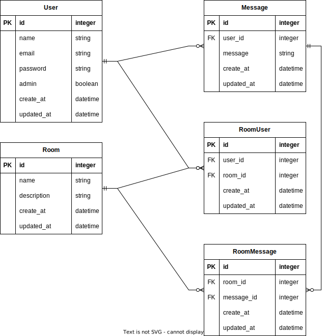

# 藤本研究室 chatApp

## Pull Req

main を本番として、delelop から feature を切る。
CI/CD が構築できたら、main←develop,develop←feature の Pull Req のタイミングで行いたい。

## 技術選定

- バックエンド

- フロントエンド

- DB

- ホスティング

### 補足

```bash
chmod +x start.sh
./start.sh service_name
```

で各コンテナに入れる

### front 立ち上げ

```bash
npm install
npm run dev
```

### er 図


